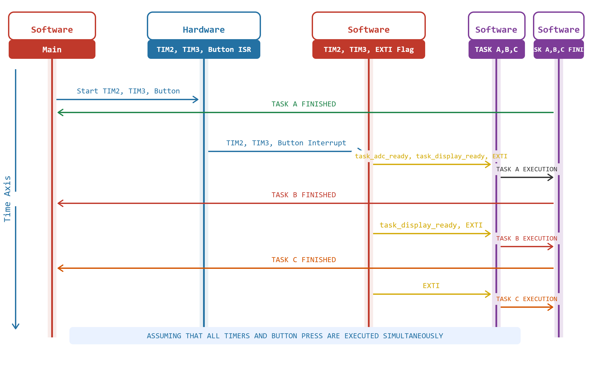

Laboratory Activity 1: Timers, Interrupts, and Task Scheduling

Course: BCA143 Firmware Programming  
Student: Macasero, Princess Nashema  
Date: June 13, 2026  

Project Description

This project explores timer interrupts and task scheduling on the RT-Spark Development Board. Two hardware timers are configured to fire at different intervals, controlling LEDs and triggering foreground tasks. A button-triggered external interrupt is also incorporated to illustrate event-driven scheduling behavior.

Hardware
- RT-Thread RT-Spark Development Board (STM32F407ZGT6)
- LEDs: PF11 (Red), PF12 (Blue)
- User Button: PA0
- Debug Pin: PE0

Features
- TIM2: 1 Hz periodic interrupt (high priority)
- TIM3: 2 Hz periodic interrupt (medium priority)
- External interrupt on button press
- Foreground/background system architecture
- Timing measurement and analysis

Timing Measurements

## Timing Measurements

| Parameter | Definition | Measured Value | Units |
|---|---|---|---|
| TRelease(TIM2) | Timer interrupt occurs | 1.0 | seconds |
| TLatency(Task A) | Delay before Task A starts | 24.94 | µs |
| TISR(TIM2) | Time in ISR | 4.31 | µs |
| TTask(Task A) | Task A execution time | 50 | ms |
| TResponse(Task A) | Total response time | 50.02443 | ms |

Sequence Diagram

Build Instructions
1. Open project in STM32CubeIDE
2. Build: Project → Build All
3. Connect RT-Spark via USB
4. Upload: Run → Debug or Run

 Analysis
1.What is the maximum latency for Task A in your system?
The maximum latency for Task A is 70ms. This occurs when the interrupt fires at the same moment Task A (50ms) and Task B (20ms) are both executing, causing Task A to wait for both tasks to complete before the main loop can check its flag.
2. If Task B is running when TIM2 interrupt occurs, how does it affect TLatency(Task A)?      
When the interrupt fires, the flag is set right away, but Task A cannot be processed by the main loop until Task B has completed its execution. This means TLatency grows longer depending on how much of Task B's 20ms delay still remains.
3. Calculate worst-case TResponse for Task A if all other tasks are running
The worst-case TResponse is 120ms in total. This is computed by adding the maximum waiting time of 70ms — which accounts for both Task A and Task B running — to Task A's own execution time of 50ms.
4. How would response time change with a preemptive scheduler?
With a preemptive scheduler, the currently running task would be immediately suspended the moment a higher-priority interrupt fires. This brings the latency down to nearly zero, resulting in a much faster and more predictable response time overall.

References
1. Castor, P. R. P. (2025). Software Design Basics [Lecture 2]. BCA143 Firmware Programming, MSU-IIT.
2. STMicroelectronics. (2024). STM32F4 HAL Driver User Manual.